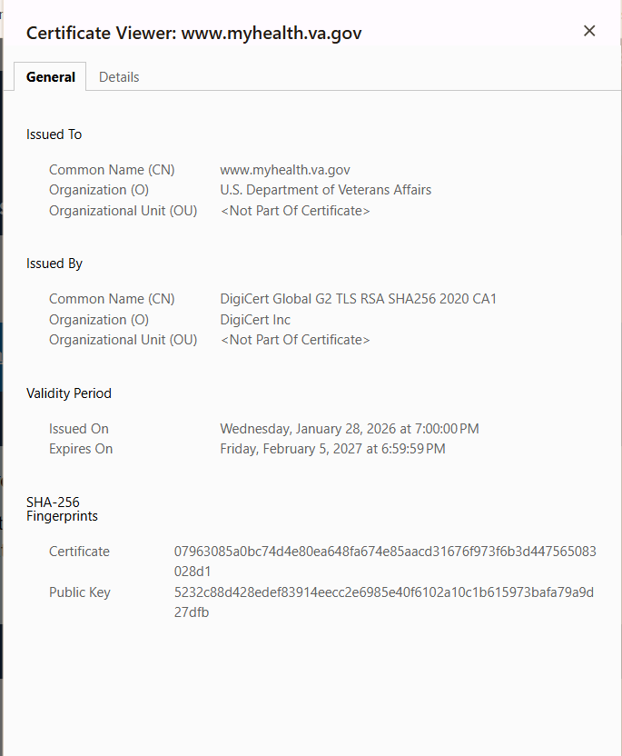

# Week 01 Lab — Certificate Inspection

## Screenshot Evidence

1. Capture a screenshot of the certificate details in your browser.
2. Save it as:

assets/screenshots/week-01/certificate-inspection.png

3. Embed the screenshot below:

## Website Information

**Website inspected:**  
www.myhealth.va.gov

**Issuer (Certificate Authority):**  
DigiCert

**Valid from:**  
Wednesday, January 28, 2026

**Valid until:**  
Friday, February 5, 2027 at 6:59:59 PM

**Signature algorithm:**  
<!-- Example: sha256WithRSAEncryption -->
SHA256WithRSAEncryption

---

## Subject Alternative Names (SAN Entries)

List at least 2–3 SAN entries:

- www.myhealth.va.gov
- myhealth.va.gov
- sm.myhealth.va.gov

---

## Observations

Document three observations about the certificate.

### Observation 1
I noticed for this certificate it is issued by DigiCert. 

### Observation 2
This certificate also has a longer valdation time frame than the pervious certificate in the first lab. This certificate is validated a year and 1 month versus the other certifcate that was only valid for 3 months.

### Observation 3
I also noticed that the certificate validates multiple domain variations of the same website, such as www.myhealth.va.gov and myheath.va.gov. This would ensure that an user could still access the website securely if they omitted putting www before the web address.

---

## Reflection

Based on your inspection, explain how this certificate contributes to secure HTTPS communication.

(2–3 sentences)

This certifcate helps support secure HTTPS communication by verifying the identity of the website and enabling encrypted connections between the user and the server. Because it is issued by DigiCert the browser can trust that the website is legitimate.The certificate's public key is used to confirm that the connection is secure with the private key. 
