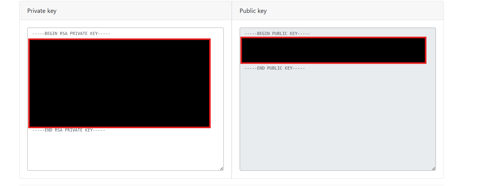

# Week 01 Lab — Key Pair Generation

## Screenshot Evidence

If using OpenSSL:
1. Capture a screenshot showing:
  - The command used to generate the private key
  - The command used to extract the public key
2. Save it as:

**assets/screenshots/week-01/keypair-generation.png**

3. Embed the screenshot below:

****

If using a browser-based generator, capture the generated key pair screen (redact sensitive portions of the private key before committing).

---

## Key Identification
**Which file is the public key?**
The output on the right is the public key

**Which file is the private key?**
The output on the left is the private key

---

## Key Properties
Briefly describe:
- What makes the public key safe to share
- What makes the private key sensitive

The public key is issued to another party to decrypt the data that is encrytped by the private key. They private key is what is needed to decrypt data it also creates a digital signitare that confirms that something was done by an individual, thats why it is sensitive. 
 
---

## Security Scenario
What would happen if someone obtained your private key?

Explain the risk in terms of:
  - Identity
  - Impersonation
  - Trust

If a private key got into the wrong hands it could potentionally leak private data, someone can impersonate the individual that owns the privaate key, and or they would have to go through a more through security check to authenticate the identity moving forard.

---

## Observations
Document three observations from this lab.

### Observation 1
<!-- What did you notice about key generation? -->
I noticed that depending on what size key you chooses determines how fast the key gets generated. 

### Observation 2
<!-- What did you notice about key size or format? -->
When I generated both the private and public key I noticed that the public key was shorter than the private key. 

### Observation 3
<!-- What did you notice about how the keys differ? -->
The letters are similar at the begining of both keys and I notice they both use similar special characters like / and +.

---

## Reflection
In 3–5 sentences, explain:

Why must the private key remain secret in a PKI system?

The private keys must remain a secret because they are the needed link to decrypt data that was encrypted with both the public and private keys.

Focus on how identity is tied to possession of the private key.
Identity is tied to possesion of the private key because the private and public key are generated in pairs. Only the owner of the private key should know both keys. 
