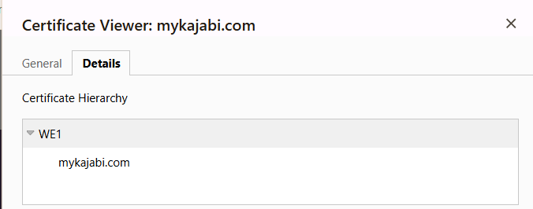

# Week 01 Mini Lab — Trust Chain Validation

## Screenshot Evidence

Capture a screenshot of the Certification Path (certificate chain) from your browser.

Save it as:

assets/screenshots/week-01/trust-chain-validation.png

Embed the screenshot below:

## Website Information

**Website inspected:**  
https://tonia-webster.mykajabi.com/products/pki-career-pathway-cohort/categories/2159393155/posts/2195018900

---

## Certificate Chain Breakdown

**Leaf (Server) Certificate**  
mykajabi.com

**Intermediate Certificate Authority**
WE1

**Root Certificate Authority (Trust Anchor)**
Google Trust Services

---

## Trust Anchor Verification

Is the Root CA marked as trusted by your system?

Yes

If yes, explain where that trust comes from (OS/browser root store).
The trust comes from Google Trust Services

If no, explain what warning or behavior occurred.

---

## Observations

Document three observations about the certificate.

### Observation 1
<!-- What did you notice about the chain structure? -->
I noticed that the validation of the certifciate starts from the bottom of the structure and moves up. 

### Observation 2
<!-- What did you notice about the Root CA? -->
I noticed that the Root CA is only issuing the certifcate to the website for up to 3 months

### Observation 3
<!-- What did you notice about how the browser determines trust? -->
From my analysis I believe the browser determines trust by first validating if the certificate is currently vaild with the information that is public in the Google Trust Services and then from there it validates the public keys from the website to determine if the keys match. 

---

## Reflection

In 3–5 sentences, explain:
- Why the Root certificate is called a trust anchor
- How validation walks the certificate chain
- What would happen if the Root CA were not trusted

The Root certificate is called the trust anchor because it is the main hub to validate all public and private keys for a certificate that it issues. It starts by first validating the identity of the certificate making sure its not expired and then comparing the private and public keys to the trust to make sure the request is valid. If the Root CA was not trusted the certificate would not be vaild. 
